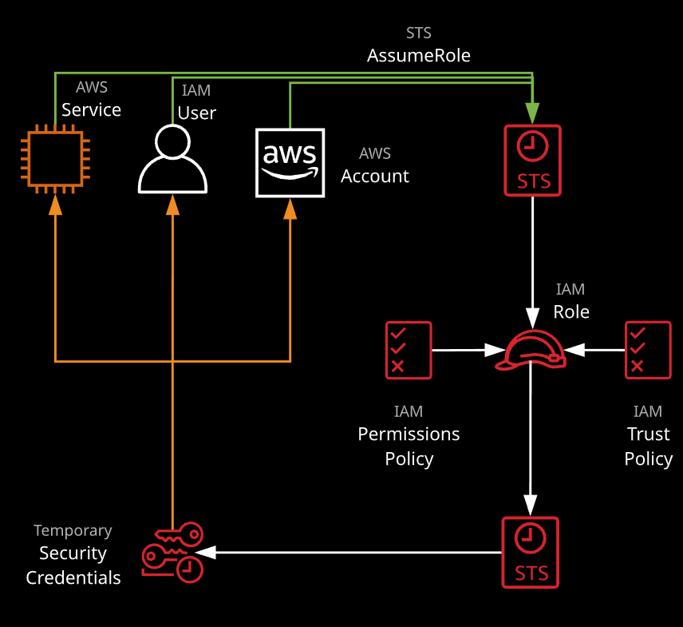

## AWS certification

+ *Access management basics*:

    + Elasticity: when horizontally scaling is used to match  capacity with demand
    + principal: a person that can make and authenticated or anonymous call.
    + Authentication: proccess to authenticate a principal against an identity
    + Identity: Objects that require authentication or are authorized to access resources.
    + Authorization: the process or denying or allowing access to a resource for an identity.
    + High availability: hardware and software that allow the system to recover quickly in case of failure
    + Fault Tolerance: system design to operate over failure.
    + recovery point objective:  The maximum time between the failure and the backup.
    + Vertical scaling: add more resources in form of cpu and memory to the existing machine.
    + Horizontal scaling: add  additional machines into a pool of resources.

+ three layer architecture: presentation, logic, data.
    + presentation: interacts with the consumer.
    + logic tier: which delivers the app functionality
    + data tier: which controls the interaction with the database.

+ Encryption:
    + the proccess to taking plain text and transform it into ciphertext.
    + generally uses an algorithm with one or more keys.
    + commonly used to encrypt data at rest or in transit.
    + The process can be symmetrical (where the same key is used for encryption and decryption) or asymmetrical where different keys are used.

+ common terms:
    + **Application state:** data that represents what a customer is doing.
    + Undifferentiated heavy lifting: A part of the system that is not specific to your business.

+ Accounts:
    + every account is isolated with a single root user for billing and access.

+ Well architected  framework:
    + Security:
        + Implement a strong identity foundation
        + Enable traceability
        + Apply Security at all layers
        + Automate security best practices
        + Protect data in transit and at rest
        + Prepare for security events
    + Reliability: The ability of the system to recover from infrastructure or service disruption.
        + Test recovery procedures
        + Automatically recover from failure.
        + Scale horizontally to increase system availability
        + Stop guessing capacity
        + manage changing automation
    + Performance efficiency:
        + Democratize advanced technologies.
        + Go global in minutes
        + use serveless architectures
        + Experiment more often
    + Operational excellence:
        + perform operations as code
        + annotate documentation
        + make frequent small changes
        + redefine operations procedures frequently
        + Anticipate failure
        + learn from failure
    + Cost Optimization
        + Adopt a consumption model
        + Measure overall efficiency
        + stop spending money at data centers
        + analyse and distribute expenditure
        + Used managed services to reduce cost of ownership
+ S3
    + Region -> bucket
    + bucket -> object
    + object -> Similar to a file, has a key and a value, can contain from zero to 5TB, has a unique name in a bucket

+ Identity and access control: control access to AWS services via polices
    1. Policies: can be attached to users, groups and roles.
        + Users are given longterm credentials.
        + roles are given temporal credentials.
        + example:
        
            + principal -> role -> policy -> credentials -> access to a s3 bucket
            + policy -> apply to groups and users -> get Credentials -> access to s3 bucket
            + there are 2 types:
                + Identity policy: when it is attached to a identity
                + resource policy: when it is attached to a resource

        + policy document:
            + List of statements
            + Each statement matches a request to AWS, request are matched based on their action.
    2. Users:  a type of identity for long term access(human, service or application)
        + principals authenticate to IAM users either with username and password or access keys

            + Principal -> username, passport ->  user(has a policy) -> access to a resource
            + Principal -> access keys -> user(has a policy) -> access to a resource

    3. Groups: Collection of users, they are not a true identity so they can not be used in resource policies.
        + Access keys:
            + Access key id: store by AWS
            + Secret access key: stored by the user

    4. Roles: they are assume by another identity allowed in the trust policy
        + when a role is asume the STS ( Security token service) generates a temporal set of access keys
        + the roles is assume if:
        
        + 