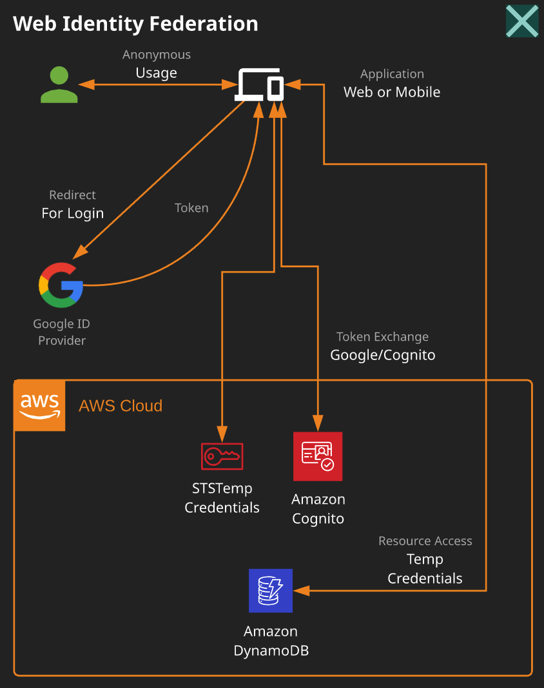
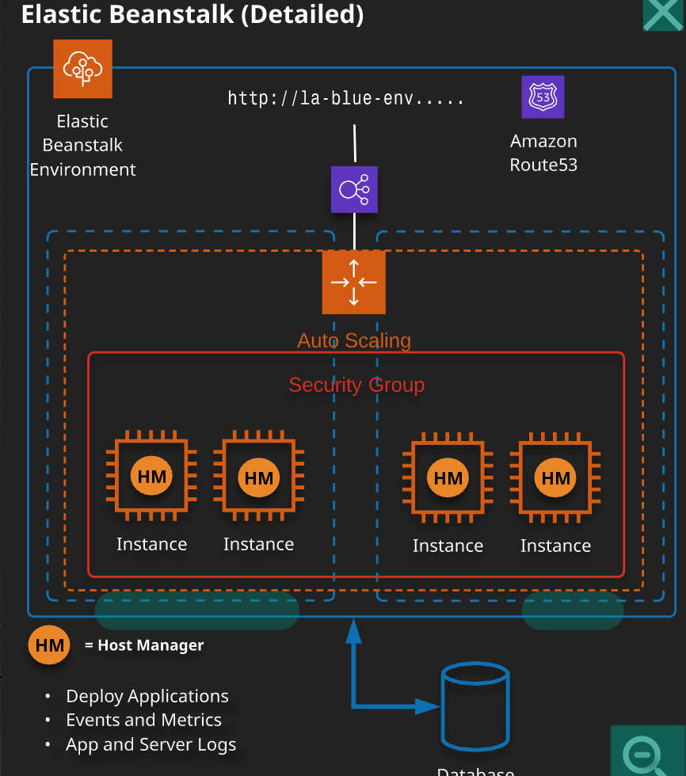

## AWS certification

+ *Access management basics*:

    + Elasticity: When horizontally scaling is used to match  capacity with demand
    + principal: a person that can make and authenticated or anonymous call.
    + Authentication: process to authenticate a principal against an identity
    + Identity: Objects that require authentication or are authorized to access resources.
    + Authorization: the process or denying or allowing access to a resource for an identity.
    + High availability: hardware and software that allow the system to recover quickly in case of failure
    + Fault Tolerance: system design to operate over failure.
    + recovery point objective:  The maximum time between the failure and the backup.
    + Vertical scaling: add more resources in form of cpu and memory to the existing machine.
    + Horizontal scaling: add  additional machines into a pool of resources.

+ three layer architecture: presentation, logic, data.
    + presentation: interacts with the consumer.
    + logic tier: which delivers the app functionality
    + data tier: which controls the interaction with the database.

+ Encryption:
    + the process to taking plain text and transform it into ciphertext.
    + generally uses an algorithm with one or more keys.
    + commonly used to encrypt data at rest or in transit.
    + The process can be symmetrical (where the same key is used for encryption and decryption) or asymmetrical where different keys are used.

+ common terms:
    + **Application state:** data that represents what a customer is doing.
    + Undifferentiated heavy lifting: A part of the system that is not specific to your business.

+ Accounts:
    + every account is isolated with a single root user for billing and access.

+ Well architected  framework:
    + Security:
        + Implement a strong identity foundation
        + Enable traceability
        + Apply Security at all layers
        + Automate security best practices
        + Protect data in transit and at rest
        + Prepare for security events
    + Reliability: The ability of the system to recover from infrastructure or service disruption.
        + Test recovery procedures
        + Automatically recover from failure.
        + Scale horizontally to increase system availability
        + Stop guessing capacity
        + manage changing automation
    + Performance efficiency:
        + Democratize advanced technologies.
        + Go global in minutes
        + use serveless architectures
        + Experiment more often
    + Operational excellence:
        + perform operations as code
        + annotate documentation
        + make frequent small changes
        + redefine operations procedures frequently
        + Anticipate failure
        + learn from failure
    + Cost Optimization
        + Adopt a consumption model
        + Measure overall efficiency
        + stop spending money at data centers
        + analyse and distribute expenditure
        + Used managed services to reduce cost of ownership
+ S3
    + Region -> bucket
    + bucket -> object
    + object -> Similar to a file, has a key and a value, can contain from zero to 5TB, has a unique name in a bucket
    + Glacier, storage thought to infrequently access:
        + Expedited retrieval allows access to your data from 1 to 5 mins
        + Vault lock and standard retrieval  are 3 - 5 hrs retrieval time.
        + Bulk retrieval, can be considered as the cheaper option 5 -12 hrs
    + Presigned URL gives temporal access to a S3 bucket
    + It allows you cross Region replication
    updates to the objects usually take some time

+ Identity and access control: control access to AWS services via 
   
    1. Policies: can be attached to users, groups and roles.
        + Users are given longterm credentials.
        + roles are given temporal credentials.
        + example:
            + principal -> role -> policy -> credentials -> access to a s3 bucket
            + policy -> apply to groups and users -> get Credentials -> access to s3 bucket
            + there are 2 types:
                + Identity policy: when it is attached to a identity
                + resource policy: when it is attached to a resource
        + policy tags:  you can add tags to the resources and then to create a policy to allow or deny access to it
        + policy document:
            + List of statements
            + Each statement matches a request to AWS, request are matched based on their action.
        + Permissions in the policies determine whether the request is allowed or denied.
    2. Users:  a type of identity for long term access(human, service or application)
        + principals authenticate to IAM users either with username and password or access keys

            + Principal -> username, passport ->  user(has a policy) -> access to a resource
            + Principal -> access keys -> user(has a policy) -> access to a resource
            + power user:  A paid user that gets special permissions by the administrator
    3. Groups: Collection of users, they are not a true identity so they can not be used in resource policies.
        + Access keys:
            + Access key id: store by AWS
            + Secret access key: stored by the user

    4. Roles: they are assume by another identity allowed in the trust policy
        + when a role is asume the STS ( Security token service) generates a temporal set of access keys
        + Role can be use for containers on a task
        + you can use roles to delegate access to users, applications or services
        + the roles is assume if:
   
        + 

+ Compute
    + Ec2 INSTANCES grouped by:
        + General purpose
        + compute optimized 
        + Memory optimized
        + Storage optimized
        + Acelerated computing
        + you have the option of passing user data to the instance that can be used to perform common automated configuration tasks and even run scripts after the instance starts. You can pass two types of user data to Amazon EC2: shell scripts and cloud-init directives.
    + AMI amazon machine image
    + Instances types include:
        + Low cost t2, t3 ..
    
    + Instance sizes:
        + Nano, micro, small, medium, large
        
    + EBS Elastic block store: creates and manage volumes
        + types:
            + general purpose SSD: balance price and performance < 1600 Iops
            + SSD optimized for transactional workloads involving frequent read/write operations <6400 iops
            + HHD optimized for large stream workloads 500 16 terabytes
        + ASG Autoscaling groups: it will allow me to select the right instances to reduce costs while autoscaling, being able to select between  on demand and on spot instances. 
            + cold Down period:  period that ensures that aws does not terminate additional instances before previous scaling activity takes effect
            + cloudwatch alarm has to be set along with the cold down period, so when the alarm occurs, the autoscaling launches or configures another instance.
            + Schedule scaling: when  you know the load before hand
            + Target tracking scaling policy: You select a target metric and sets and scaling value. target metric like the CPU utilization or the request count per target
            + Step scaling policies: increase or decrease the current capacity of your autoscaling group based on the scaling adjustments
        + EFS Amazon elastic file system: Store capacity is elastic, Used to allow file consistency on a network filesystem       
            + EFS encription in transit: enabling transport layer security when you mount your file system using encryption of data on transit
        + EBS snapshots: copies of data through time, snapshots are constrained by region
        + Data lifecycle manager, provides a simple and automated way to backup data stored on ebs volumes
            + you can use a life cycle police to delete the old snapshots
        + Security groups: Software farewalls that can be attached to a network interface
        + Instance metadata: data related to the instance that can be accessed from inside
        + EBS is replicated  within their availability zones
    + Amazon machine images:  are used to build instances, they store snapshots, permissions...
        + configure instance -> create the image -> launch the image
        
    + Bootstrapping is a process where the  instructions are execute  on an instance during its lunch process
     
    + Instance roles  can be assigned by EC2 using an intermediary  called instance profile
    
+ Networking 
    + VPC Virtual private cloud
        +  Isolated from other VPCs by default
        +
        +  Regional
        +  Every VPC has a vpc router 
            + It has  an interface  in every VPC subnet known as the "subnet+1"
        + For secure inbound traffic to the servers we can use 443
        + For secure inbound traffic to mySql we can use the port 3306
        + has a bastion host: is a server whose purpose is to provide access to a private network from a external network
            + a host that sits  on the VPC perimeter entry point for trusted admins, allows inbound Secure Shell (SSH) access
        + NAT (Network address translation) static NAT and dynamic NAT 
            + It is always present in public subnets.  
        + Public  subnet: it is associated with a route table that has a route to an internet gateway   
        + Gateway and nat intance are only required to access the internet.
        + NACL network access control list: has two sets of rules inbound and outbound
        + VPC peering: allows communication between VPCs
        + Security groups: virtual firewalls that control inbound and outbound traffic into AWS resources
            + default values: block all inbound traffic, allow all outbound traffic
            + uses cases: Create a security group for each one of the tiers in your app
        + ACLs Network Control Access list
            + Firewalls at the subnet boundary
            + Will allow inbound and outbound traffic by default 
            + to deny traffic  for a particular IP address in the CIDR block(set of ip addresses)
        + vpc endpoints AWS PrivateLink: Are gateways objects created within a VPC, enables you to connect your VPC to the supported AWS services
            + Steps to create it:
                + Create a Network Load Balancer for your application in your VPC and configure it for each subnet.
                + Create a VPC endpoint service configuration and specify your Network Load Balancer.
            + Gateways endpoints
            + Interface endpoints
            + RedShift  enhanced vpc routing  provides VPC resources access to RedShift
        + DNS domain name service: 
            + CNAME records allows aliases to be created to certain domains
        + NAT Gateway: network address translation managed by AWS, it is  linked to the availability zone.
        + NAT Instances: enable intances in a private subnet to initiate outbound traffic  
        + ROUTE 53
            + weighted routing: control the amount of traffic that reaches a specific resource.
            + geolocation routing
            + policies to route traffic:
                + Simple routing traffic: A single resource that performs a given function for your domain
                + Latency routing policy: Use when you have resources in multiple locations and you want to route traffic based on latency
                + Weighted routing policy: route traffic in proportions that you specify
                + Multivalue routing policy: respond to DNS queries with up to eight healthy records
                + Failover routing policy: When you want to configure active passive failover
        + aws privateLink:secure private access adding a Elastic Network interface
        + VPN CloudHub: provide secure communication between sites
            +  Border Gateway Protocol (BGP)
            + Border Gateway (BGW): re-advertise prefixes from one regional office to another
            + Each regional office should have non overlapping IP prefixes and  BGP ASN (Authonomous system number) should be unique 
         + public facing load balancer to EC2 instances that have private IP address
            + create public subnets in the same availability zone a the private subnets.   
            
+ Storage and content delivery
    + s3 access is controlled using bucket policies and ACLs
        + single put upload: upload in a single stream of data
        + multiparUpload : object is broken in parts and uploaded
        + can be configure to host web pages
        + You can use presigned urls
        + storage tier that charge base on the frecuency access to the objects in the tier
            + standard, infrequent access, glacier
        + storage can be controlled with lifeCycle rules
            +  The life cycle can be defined used rules that contains the following actions:
                + transition actions: Objects will be moved to another storage type
                + expiration actions: Objects will be deleted      
        + S3 intelligent tier class includes two tiers: frecuent and infrecuent access. It moves the data between those two tiers which helps to cost saving  
    + cloudfront content delivery network: global cache that stores copy of your data on edge points
    + delete protection:  MFA Delete, Iam roles, versioning
+ Databases:
    + RDBMS     
        + ACID: atomicy, consistency, Isolation, durability that affects the performance
        + Aurora: its throughput is 5 time faster than mySql and 3 times faster than Postgres. its replica lag is less than 100 miliseconds
            + It is fully dedicated for read operations on the cluster
    + AWS has the option of database as a service: Dbass
    + can be on 1 or multiple availability zones
    + Amazon RDS: Managed database service, has the following engines available: aurora postgress mySql, MariaDb
    + DynamoDb NoSql
        + Table a collection of items that share the same partition key
        + Item a collection of attributes that have the same key structure
        + Streams:
            + captures logs of item level modifications oN dynamoDb and then those can be streamed 
            
    + Dax in memory cache design for dynamoDb
    + Read replicas: Scale up for  read heavy database workloads
+ Hybrid and Scaling
    + ELB elastic load balancing: Distribute incoming connections to a group of servers
        + three versions:
            + Classic CLB (application)
            + Application ALB
            + Network (NLB)
        + NGINX
        + It only balance traffic in one region.
        + It will not consume a private address
    + Autoscale groups: templates to  scale in or scale out based on configurable metrics, are paired with ELBs
    + Direct connect: physical connection 
    + VPN vs direct connect
        + VPN
            + can be deployed in minutes
            + Cheap and economical.
            + Encryption required
            + Flexibility to change locations
            + Short term connectivity.
            
        + Direct Connect
            + Higher throughput
            + Consistent performance
            + Consistent low latency
            + Large amounts of data
            + No contention with existing internet Connection
            
        + Both 
            
            + VPN as additional layer of HA
            + VPN if some form of connectivity is needed immediately, before the DX connection is live
            + Can be used to add encription over the top of DX
+ Snowball and snowmobile device
    + Snowball
        + 50 to 70 TB capacity
    + Snowball edge: 
        + Includes both storage and  compute
    + SnowMobile
        + Portable datacenter.

+ Data Migration: 
    + Storage gateway: Is a hybrid service that allows you to migrate data into AWS, there are three types, It is done asynchronously:
        + File Gateway
        + Volume Gateway
            + Cached volumes: retain a copy of your frecuently accessed data and store the other on s3
            + Store volumes: if you need low latency storage access to all your dataset
        + Tape Gateway 
        +
    + Database migration DMS: is a service to migrate relational databases.
+ Identity federation IDF
    + Is an architecture where identities from a external provider  are recognized
    + Types:
        + Cross account roles: A remote account is allowed to assume a role
        + SAML 2.0 IDF allow active directory users to log into AWS
        + Web Identity Federation such as google and amazon.
        + 
+ Application Analytics and operations:
    + Application integration (decouple application):
        + SNS: A notification service that makes easier to operate, set up and send notifications to the cloud Publisher -> topic -> subscriber
            + Distribution model is one to many.
        + SQS: Decouple messages from two services, it has two options:
            + Visibility time out: is the period of the time that a message is invisible  to the rest of the application. This prevents multiple components to process the same message
            + Short Polling: returns inmediatelly even if the message is empty
            + Long Polling:  Does not return a message until it arrives to the message queue
            + Temporal storage from 1 to 14 days
            + The consumer needs to delete the message from the queue after processing it.
            + It helps with horizontal scaling
            + message group ID is the tag that specifies that the message belongs to a specific message group
                + use to avoid duplicates in  a multiple producer and consumer system
            + Deduplication Id: If a message with a particular message deduplication ID is sent successfully, any messages sent with the same message deduplication ID are accepted successfully but aren't delivered during the 5-minute deduplication interval. 
            + Deduplication: delete duplicates  
            
            
    + Elastic Transcoder: Allows you to convert media files from an input media format into another.
    + Amazon athena: interactive query service, allow queries from different range of sources, include s3 buckets
    + Elastic Map Reduce:  Is a tool for large scale parallel processing of big da ta
    + Kinesis: It is designed to ingest large amounts of data that can be access by the consumers at real time.
    + RedShift: It is a warehouse database designed for analytical workloads
    + Logging and monitoring
        + Types: AWS infrastructure logs cloud trail, vpc logs; AWS service logs: amazon s3, ELB; host based logs: Messages, security, windows events logs
        + CloudWatch: Produce real time monitoring
            + Data retention is based in granularity 
            + Logs Monitor and access logs form different services
                + VPC logs flow: It is a feature that allows you to capture information about the IP traffic
                + Log events: is a timestamp and a raw message
                + Log stream: Is a sequence of events from the same source
                + Log group: Is a container for log streams
        + CloudTrail: Records account activity inside AWS, AND API CALLS
            + Can be enable in all regions
            + Logs are encrypted
    + VPC flow logs
        + Allows you to capture metadata from the inbound and outbound traffic.
    + CloudFormation, allow you to model AWS services.
        + CloudFormation Drift can be used to detect changes outside the cloud formation templates
            + To successfully use the drift, users should have permissions to do it.
    + KMS Key management service: Provides regional, secure key management and encryption and description services.
    + ElasticBeanStalk
    +  
    + It can host containers
    + CodeBuild: Continuous integration service to build and test your applications
    + CodeDeploy: service that deploys  a variety of computes services
+ CloudFront: A web server that speeds up the distribution of your dynamic and static content
    + It can do caching based on:
        + query parameters
        + cookies with the header set-cookie
+ Caching:
    + ElasticCache: can be used in front of the databases to cache common queries.
        + Ideal to store session data along with dynamoDb
         
+ security
    + KMS a managed service that is used to create and control encryption keys  used to encrypt data
    + Aws Certificate management: it is used to generate SSL certificates to encrypt traffic  in transit 
    + STS aws security token service: a web service that allows you to request temporary credentials
    + HSM hardware security module: It is a module that manage digital encryption keys        
    + AWS amazon inspector: assessment service for security  
    + WAF web application firewall
    
            
+ Containers:
    + ECS elastic container service: it is the kubernetes container orchestration for AWS
        + Fargate launch type
        + Ec2 Launch type
        + ECR: Elastic container registry
    + + Fargate: technology to run containers               
+ Route 53  
    + you can create an alias record for a domain and subdomain.
    + Hosted zone: is a container for records and those records contain information of how you want to route the traffic to a specific domain.

+ AWS directory service:
    + Allow users to sign in with the corporate credentials
    + AD simple active directory
        + Manage users accounts and group memberships, create and apply group policies, securely connect to amazon EC2  instances
             
+ OpsWorkStacks:
    + Stack: collection of instances
    + Uses chef cookbooks for configuration management
+ AWS Config:
    + enables you to assess, audit, and evaluate the configurations of your AWS resources  
    + Snapshot, retrieve configurations of a resource, recieve  a notification if the resource was created
    + fully managed service that provides you with an AWS resource inventory, configuration history, and configuration change notifications to enable security and governance.
    
+ Serverless
    + compute: lambda
    + storage: s3, Elastic File System
    + Db: DynamoDb and Aurora
    + Proxy: Amazon api Gateway
    + Integration: sns, sqs, appSync
            
+ CORS
    +  allow cross-origin access to your Amazon S3 resources.
    + Methods: GET PUT POST DELETE HEAD
    
+ Amazon Elastic MapReduce:
    + tool for big data processing and analysis, based on hadoop
+ AWS Trusted Advisor: adds checks for Amazon S3, Amazon Redshift, EC2 Reserved Instances, security, and service limits
+ AWS glue  a managed server to  extract transform  and download data
    + Job bookmarks help AWS Glue maintain state information and prevent the reprocessing of old data. With job bookmarks, you can process new data when rerunning on a scheduled interval.
+ X-ray:  is a service that collects data about requests that your application serves, and provides tools you can use to view, filter, and gain insights into that data to identify issues and opportunities for optimization,
    helps to identify performance bottlenecks                
    
+ AWS OpsWorks: AWS OpsWorks provides even more levels of automation with
additional features like integration with configuration management software (Chef) and
application lifecycle management.   

+ Amazon quicksight: used to visualise data         
    
    
        
    
            
            
        
        

        
    